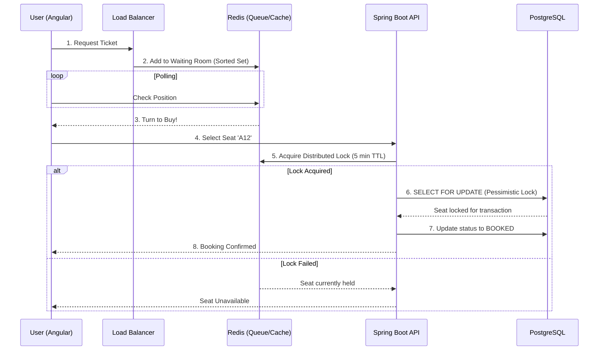

# 🎟️ High-Concurrency Ticket Booking System

An enterprise-grade ticketing platform designed to handle massive traffic spikes (up to 1 million concurrent users) without double-booking or crashing. Built with a modern Angular frontend, a Spring Boot backend, and a robust Redis + PostgreSQL data layer.

## 🚀 Tech Stack
- **Frontend:** Angular (TypeScript)
- **Backend:** Spring Boot (Java)
- **Primary Database:** PostgreSQL (Relational DB for ACID transactions)
- **Caching & Queuing:** Redis (In-memory datastore for extreme concurrency)
- **Architecture:** Client-Server, Stateless REST API, Distributed Locking

## 🏗️ System Architecture

To prevent server overloads and race conditions, the system employs a **Virtual Waiting Room** and a **Two-Tier Locking Strategy**. 



## 🧠 Concurrency Strategies Implemented
### 1. The Virtual Waiting Room (Redis)
Instead of hammering the SQL database, users are placed into a Redis Sorted Set queue. The backend throttles traffic, allowing only a safe number of users into the actual booking flow at a time.

### 2. Preventing Double Booking
- **Tier 1 (Redis Distributed Lock):** When a user clicks a seat, Redis instantly places a temporary lock (e.g., 5-minute TTL). If another user clicks the same seat, Redis rejects it in milliseconds without querying the SQL database.
- **Tier 2 (PostgreSQL Pessimistic Locking):** During checkout, Spring Boot executes `SELECT * FROM seats WHERE id = ? FOR UPDATE`. This guarantees ACID compliance at the database level, ensuring the ticket is never sold twice even if the cache fails.

## 🗄️ Database Schema

### PostgreSQL Tables
- **`users`**: `id` (UUID), `email`, `password_hash`
- **`events`**: `id`, `name`, `date`, `venue`
- **`seats`**: `id`, `event_id`, `seat_number`, `status` (AVAILABLE, RESERVED, BOOKED), `price`
- **`bookings`**: `id`, `user_id`, `seat_id`, `booking_time`, `payment_status`

## 📁 Project Structure (Monorepo)
```text
ticket-booking-platform/
│
├── frontend/                     # Angular Application
│   ├── src/app/
│   │   ├── components/           # WaitingRoom, StadiumMap, Checkout
│   │   ├── services/             # TicketService, QueueService
│   │   └── models/               # TS Interfaces
│
└── backend/                      # Spring Boot Application
    ├── src/main/java/com/tickets/
    │   ├── controllers/          # TicketController, QueueController
    │   ├── services/             # BookingService, QueueService (Redis Logic)
    │   ├── repositories/         # Spring Data JPA
    │   └── models/               # JPA Entities (Event, Seat, Booking)
    └── src/main/resources/
        └── application.yml       # DB connection pool, Redis host
```
## Scaling Strategy (Future-Proofing)

**Modular Monolith**

Even though it is a single application, because it is *stateless*, you can still run 50 instances of it behind a Load Balancer to handle massive traffic.
However, in a true real-world scenario with 1 million concurrent users, companies like Ticketmaster or BookMyShow would split this into a **Distributed Microservices Architecture**.

Here is why they split it, and how your system would break down:

### Why Split It? (Independent Scaling)

During a ticket launch, 990,000 people are just waiting in the queue or looking at the stadium map, while only 10,000 are actually processing payments.
If it is a single application, you have to scale the *entire* heavy application 100x. If you split it into microservices, you only scale the parts that need it.

### How it would be split into Microservices:

**1. The Queue Service (High Traffic, Lightweight)**

* **Role:** Acts as the bouncer. It only talks to Redis.
* **Scale:** Massive. You might spin up 200 instances of this service because it takes the initial hit of 1 million users polling their queue status every 5 seconds.
* **Tech:** Spring Boot (or even something faster like Go or Node.js).

**2. The Search/Inventory Service (High Read Traffic)**

* **Role:** Serves the stadium map and shows which seats are greyed out.
* **Scale:** High. It reads from a Redis Cache (not the SQL DB) to quickly serve seat statuses to thousands of users looking at the map.

**3. The Booking/Payment Service (Low Traffic, Heavy Compute)**

* **Role:** Handles the actual `SELECT FOR UPDATE` PostgreSQL locks, processes credit cards, and confirms the ticket.
* **Scale:** Low. Because the Queue Service throttles traffic, only a few thousand users ever reach this service at once. It requires precision and safety over raw speed.

---

### The Trade-Off

While microservices offer incredible scaling efficiency, they introduce massive complexity. You suddenly have to deal with **Network Latency** between services, and if the Payment Service crashes while the Inventory Service is running, you have to write complex rollback logic (called the Saga Pattern).

**How would you like to proceed?** We can stick with the **Modular Monolith** (single Spring Boot app) to build out the core locking logic first, or we can jump straight into the deep end and design the **Queue Service** as a completely separate microservice.
